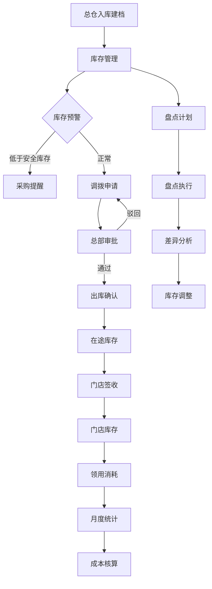

# 连锁零售门店耗材进销存管控系统 - 产品需求文档

## 1. 产品概述

本系统是为连锁零售门店（奶茶、汽修、零售等多业态）打造的耗材进销存一体化管控平台。系统实现总仓至门店的物料统一管理，覆盖包装耗材、清洁物料、设备配件的全生命周期管理，支持总仓调拨、门店领用、月度消耗盘点、临期耗材登记等核心业务流程，内置连锁经营标准的耗材分类、调拨流程和安全库存阈值，帮助连锁企业实现标准化物料管控和成本优化。

**目标用户**：连锁零售企业总部管理人员、门店店长、库管人员、财务人员  
**核心价值**：降低物料损耗率15-20%，提升库存周转效率30%，实现多门店物料成本透明化管理

## 2. 核心功能

### 2.1 用户角色

| 角色 | 注册方式 | 核心权限 |
|------|---------|---------|
| 系统管理员 | 后台创建 | 系统配置、用户管理、数据权限分配 |
| 总部库管 | 后台创建 | 耗材入库建档、调拨登记、库存盘点、报表查看 |
| 门店店长 | 后台创建 | 门店领用申请、消耗登记、库存查询、门店报表 |
| 财务人员 | 后台创建 | 成本核算、报表审核、财务对账 |

### 2.2 功能模块

1. **总仓管理**：耗材入库建档、库存查询、安全库存预警、临期耗材管理
2. **调拨管理**：调拨申请、调拨审批、调拨出库、门店签收、调拨记录查询
3. **门店管理**：门店信息维护、门店库存查询、门店领用登记、月度消耗统计
4. **盘点管理**：盘点计划制定、盘点执行、差异分析、盘点归档
5. **报表中心**：库存报表、消耗报表、成本报表、调拨报表
6. **系统管理**：用户管理、角色权限、门店管理、耗材分类管理

### 2.3 页面详情

| 页面名称 | 模块名称 | 功能描述 |
|---------|---------|---------|
| 登录页 | 用户认证 | 用户登录、记住密码、验证码校验 |
| 首页 | 数据概览 | 库存预警、待办事项、消耗趋势图、快捷入口 |
| 耗材入库 | 入库建档 | 录入耗材名称、规格、采购成本、保质期、存放货架分区，支持批量导入 |
| 耗材列表 | 库存管理 | 耗材查询、库存查看、安全库存设置、临期预警、导出功能 |
| 调拨申请 | 新建调拨 | 选择目标门店、添加调拨耗材、设置数量、选择出库日期 |
| 调拨审批 | 审批流程 | 查看待审批调拨单、审批通过/驳回、添加审批意见 |
| 调拨出库 | 出库确认 | 确认出库、打印出库单、更新库存 |
| 门店签收 | 签收确认 | 确认签收、录入实收数量、差异登记 |
| 门店领用 | 领用登记 | 门店员工领用登记、领用记录查询 |
| 月度消耗 | 消耗统计 | 按月统计门店耗材消耗、成本核算、导出报表 |
| 盘点计划 | 计划管理 | 创建盘点计划、分配盘点任务、设置盘点范围 |
| 盘点执行 | 盘点录入 | 录入盘点数量、差异标记、拍照上传 |
| 盘点分析 | 差异分析 | 账面与实物对比、差异原因分析、调整建议 |
| 库存报表 | 报表查看 | 总仓库存汇总、门店库存汇总、库存周转率分析 |
| 消耗报表 | 成本分析 | 门店消耗对比、成本趋势分析、异常消耗预警 |
| 用户管理 | 权限配置 | 用户增删改查、角色分配、密码重置 |
| 门店管理 | 门店配置 | 门店信息维护、门店状态管理、门店分类 |

## 3. 核心流程

### 3.1 耗材入库流程
总部库管在系统录入耗材基本信息（名称、规格、采购成本、保质期、存放位置），系统自动生成耗材编码并更新总仓库存，同时检查安全库存阈值，低于阈值时触发预警通知。

### 3.2 调拨流程
门店店长提交调拨申请 → 总部库管审核 → 审核通过后库管确认出库 → 系统扣减总仓库存并生成在途库存 → 门店签收确认 → 系统增加门店库存并清除在途库存 → 完成调拨流程。

### 3.3 月度消耗登记流程
门店店长按月登记本店耗材消耗情况，系统自动计算月度物料成本，生成消耗报表，并与库存数据进行核对，确保账实相符。

### 3.4 盘点流程
总部制定盘点计划 → 分配盘点任务 → 盘点人员现场录入实物数量 → 系统自动对比账面库存 → 生成差异报告 → 审批调整 → 更新库存数据并归档。

## 4. 用户界面设计

### 4.1 设计风格

**主题色彩**：
- 主色调：深蓝色 #1E3A8A（专业、稳重、可信赖）
- 辅助色：青绿色 #059669（活力、成长、效率）
- 警示色：橙红色 #DC2626（预警、重要提示）
- 背景色：浅灰 #F3F4F6、白色 #FFFFFF
- 文字色：深灰 #1F2937、中灰 #6B7280

**按钮样式**：
- 主要按钮：圆角8px，渐变背景，悬停时上浮阴影效果
- 次要按钮：圆角8px，边框样式，悬停时边框加深
- 危险按钮：红色系，用于删除等操作

**字体规范**：
- 标题字体：思源黑体 / Source Sans Pro，字重600-700
- 正文字体：系统默认字体，字重400
- 字号：标题24-32px，小标题18-20px，正文14-16px

**布局风格**：
- 左侧固定导航栏（宽度220px）
- 顶部面包屑导航和用户信息栏
- 主内容区域卡片式布局
- 响应式设计，支持桌面端和移动端

**图标风格**：
- 使用线性图标（Line Icons）
- 统一图标尺寸20px
- 颜色跟随主题色

### 4.2 页面设计概览

| 页面名称 | 模块名称 | UI元素 |
|---------|---------|--------|
| 登录页 | 登录表单 | 居中卡片式布局，品牌Logo，输入框带图标，渐变登录按钮，验证码输入 |
| 首页 | 数据概览 | 顶部统计卡片（库存预警、待审批、本月消耗、在途调拨），中部趋势图表，底部待办列表 |
| 耗材入库 | 入库表单 | 左侧表单区域（基本信息、规格参数、存放位置），右侧预览卡片，底部操作按钮 |
| 耗材列表 | 数据表格 | 顶部搜索筛选栏，主体数据表格（支持排序、分页），右侧操作列，底部批量操作栏 |
| 调拨申请 | 申请表单 | 步骤条导航（选择门店→添加耗材→确认提交），表单区域，耗材选择弹窗 |
| 调拨审批 | 审批列表 | 卡片式审批项，审批意见输入框，通过/驳回按钮，审批历史时间轴 |
| 门店签收 | 签收表单 | 调拨单详情展示，实收数量输入，差异说明文本框，签收确认按钮 |
| 月度消耗 | 统计报表 | 月份选择器，门店筛选，消耗明细表格，成本汇总卡片，导出按钮 |
| 盘点执行 | 盘点录入 | 盘点任务列表，实物数量输入框，差异自动计算，拍照上传组件 |
| 库存报表 | 图表展示 | 多维度筛选器，柱状图/折线图/饼图切换，数据表格，导出功能 |

### 4.3 响应式设计

- **桌面优先**：主要面向办公场景，优先适配1920x1080及以上分辨率
- **平板适配**：支持1024-1366px分辨率，导航栏可折叠
- **移动适配**：支持375-768px分辨率，采用单列布局，表格转为卡片展示
- **触控优化**：按钮和交互元素最小触控区域44x44px

### 4.4 交互设计

**动画效果**：
- 页面切换：淡入淡出效果，时长300ms
- 卡片悬停：轻微上浮（translateY: -4px）+ 阴影增强
- 按钮点击：缩放效果（scale: 0.98）
- 数据加载：骨架屏加载效果
- 表格排序：列头排序图标旋转动画

**反馈提示**：
- 操作成功：顶部绿色提示条，3秒自动消失
- 操作失败：顶部红色提示条，需手动关闭
- 删除确认：弹窗二次确认
- 表单验证：输入框下方红色错误提示文字

## 5. 非功能性需求

### 5.1 性能要求
- 页面首屏加载时间 < 2秒
- 接口响应时间 < 500ms
- 支持100+并发用户
- 数据库查询优化，复杂查询 < 1秒

### 5.2 安全要求
- 用户密码加密存储（BCrypt）
- JWT Token身份认证
- 接口权限校验
- SQL注入防护
- XSS攻击防护
- 操作日志记录

### 5.3 可用性要求
- 系统可用性 99.5%
- 数据每日自动备份
- 异常情况自动告警
- 关键操作支持撤销

### 5.4 兼容性要求
- 浏览器：Chrome 90+、Edge 90+、Firefox 88+、Safari 14+
- 操作系统：Windows 10+、macOS 11+、主流Linux发行版