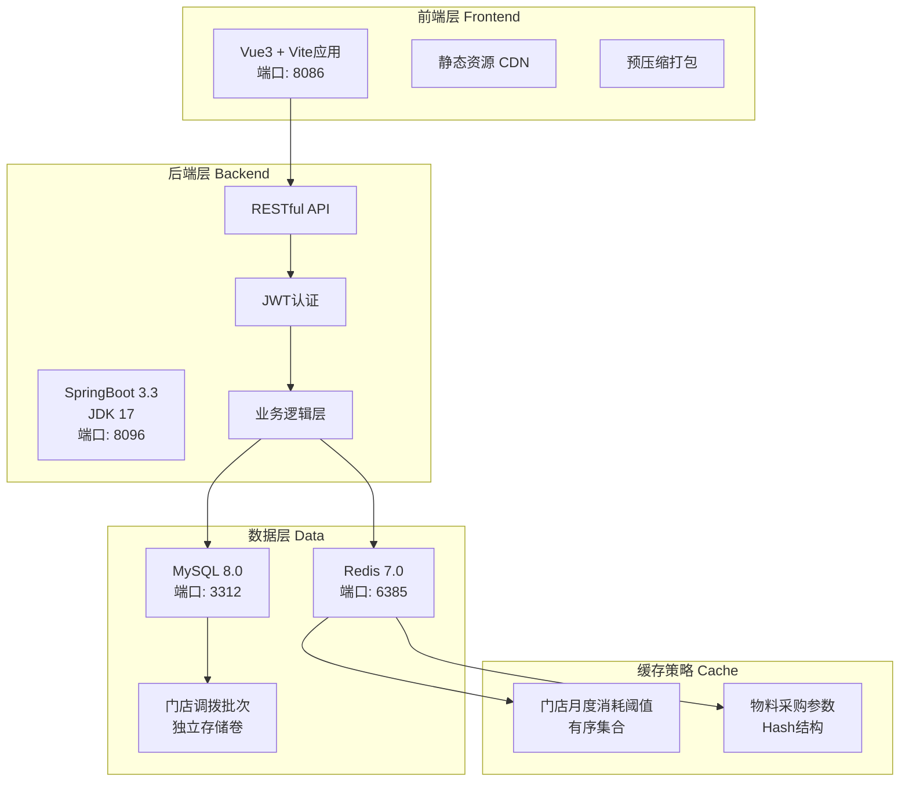
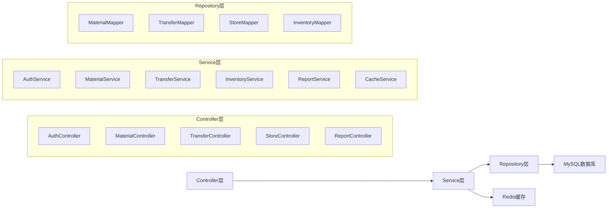
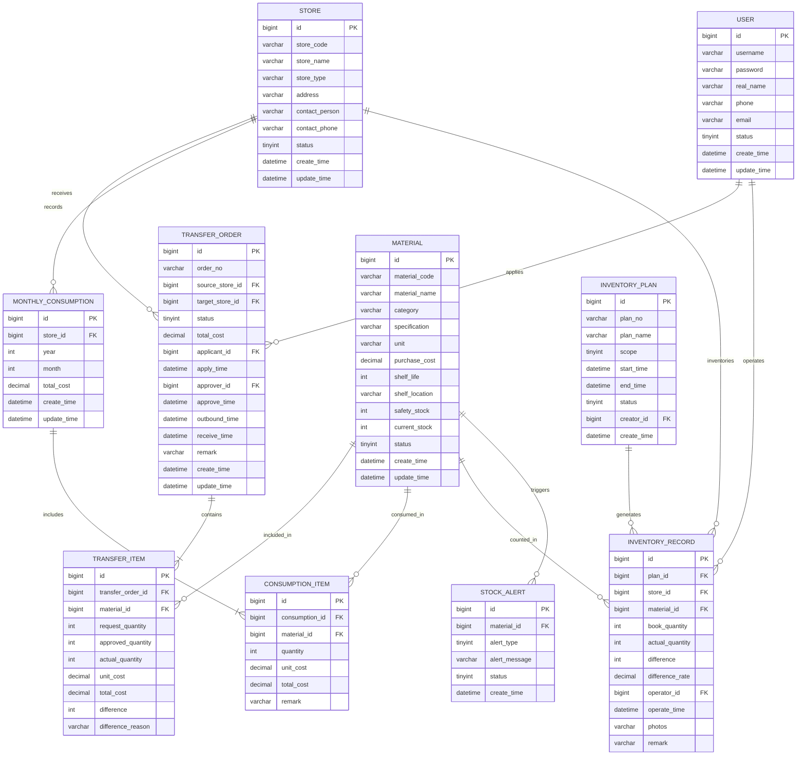

# 连锁零售门店耗材进销存管控系统 - 技术架构文档

## 1. 架构设计



## 2. 技术栈说明

### 2.1 前端技术栈
- **框架**: Vue 3.4 + Composition API
- **构建工具**: Vite 5.0
- **UI组件库**: Element Plus 2.5
- **状态管理**: Pinia 2.1
- **路由管理**: Vue Router 4.2
- **HTTP客户端**: Axios 1.6
- **图表库**: ECharts 5.5
- **工具库**: 
  - Day.js（日期处理）
  - Lodash-es（工具函数）
  - VueUse（组合式API工具集）

### 2.2 后端技术栈
- **核心框架**: Spring Boot 3.3 + JDK 17
- **安全框架**: Spring Security 6.2 + JWT
- **ORM框架**: MyBatis-Plus 3.5
- **数据库**: MySQL 8.0（Alpine精简镜像）
- **缓存**: Redis 7.0
- **API文档**: Knife4j 4.4（Swagger增强）
- **工具库**:
  - Hutool 5.8（Java工具库）
  - Lombok（代码简化）
  - MapStruct 1.5（对象映射）

### 2.3 开发工具
- **包管理器**: npm（中科大镜像源）
- **依赖管理**: Maven（网易开源镜像源）
- **容器化**: Docker + Docker Compose
- **版本控制**: Git

## 3. 路由定义

### 3.1 前端路由

| 路由路径 | 页面名称 | 权限要求 | 说明 |
|---------|---------|---------|------|
| /login | 登录页 | 无需认证 | 用户登录入口 |
| /dashboard | 首页 | 已认证 | 数据概览仪表盘 |
| /warehouse/materials | 耗材列表 | 总部库管 | 耗材库存管理 |
| /warehouse/inbound | 耗材入库 | 总部库管 | 新增耗材入库 |
| /transfer/apply | 调拨申请 | 门店店长 | 创建调拨申请 |
| /transfer/approval | 调拨审批 | 总部库管 | 审批调拨单 |
| /transfer/outbound | 调拨出库 | 总部库管 | 确认出库 |
| /transfer/receive | 门店签收 | 门店店长 | 签收确认 |
| /store/requisition | 门店领用 | 门店店长 | 领用登记 |
| /store/consumption | 月度消耗 | 门店店长 | 消耗统计 |
| /inventory/plan | 盘点计划 | 总部库管 | 盘点计划管理 |
| /inventory/execute | 盘点执行 | 盘点人员 | 现场盘点 |
| /inventory/analysis | 盘点分析 | 总部库管 | 差异分析 |
| /report/stock | 库存报表 | 财务人员 | 库存统计报表 |
| /report/consumption | 消耗报表 | 财务人员 | 成本分析报表 |
| /system/user | 用户管理 | 系统管理员 | 用户权限配置 |
| /system/store | 门店管理 | 系统管理员 | 门店信息维护 |

### 3.2 后端API路由

| HTTP方法 | API路径 | 功能描述 | 权限要求 |
|---------|---------|---------|---------|
| POST | /api/auth/login | 用户登录 | 无需认证 |
| POST | /api/auth/logout | 用户登出 | 已认证 |
| GET | /api/auth/info | 获取用户信息 | 已认证 |
| GET | /api/materials | 查询耗材列表 | 已认证 |
| POST | /api/materials | 新增耗材 | 总部库管 |
| PUT | /api/materials/{id} | 更新耗材信息 | 总部库管 |
| DELETE | /api/materials/{id} | 删除耗材 | 总部库管 |
| GET | /api/materials/stock | 查询库存 | 已认证 |
| POST | /api/transfers | 创建调拨申请 | 门店店长 |
| GET | /api/transfers | 查询调拨列表 | 已认证 |
| PUT | /api/transfers/{id}/approve | 审批调拨 | 总部库管 |
| PUT | /api/transfers/{id}/outbound | 确认出库 | 总部库管 |
| PUT | /api/transfers/{id}/receive | 门店签收 | 门店店长 |
| GET | /api/stores | 查询门店列表 | 已认证 |
| POST | /api/consumptions | 登记消耗 | 门店店长 |
| GET | /api/consumptions/monthly | 月度消耗统计 | 已认证 |
| POST | /api/inventories/plan | 创建盘点计划 | 总部库管 |
| POST | /api/inventories/execute | 执行盘点 | 盘点人员 |
| GET | /api/reports/stock | 库存报表 | 财务人员 |
| GET | /api/reports/consumption | 消耗报表 | 财务人员 |

## 4. API接口定义

### 4.1 通用响应格式

```typescript
interface ApiResponse<T> {
  code: number;        // 状态码：200成功，400客户端错误，500服务器错误
  message: string;     // 响应消息
  data: T;            // 响应数据
  timestamp: number;   // 时间戳
}

interface PageResponse<T> {
  list: T[];          // 数据列表
  total: number;       // 总记录数
  pageNum: number;     // 当前页码
  pageSize: number;    // 每页大小
}
```

### 4.2 核心数据模型

```typescript
// 耗材信息
interface Material {
  id: number;
  code: string;              // 耗材编码
  name: string;               // 耗材名称
  category: string;           // 耗材分类
  specification: string;      // 规格型号
  unit: string;               // 计量单位
  purchaseCost: number;       // 采购成本
  shelfLife: number;          // 保质期（天）
  shelfLocation: string;      // 货架位置
  safetyStock: number;        // 安全库存
  currentStock: number;       // 当前库存
  status: 'normal' | 'warning' | 'expired';  // 状态
  createTime: string;
  updateTime: string;
}

// 调拨单
interface TransferOrder {
  id: number;
  orderNo: string;            // 调拨单号
  sourceStore: string;        // 调出门店（总仓）
  targetStore: string;        // 目标门店
  status: 'pending' | 'approved' | 'outbound' | 'in_transit' | 'received' | 'rejected';
  items: TransferItem[];      // 调拨明细
  totalCost: number;          // 总成本
  applicant: string;          // 申请人
  applyTime: string;          // 申请时间
  approver?: string;          // 审批人
  approveTime?: string;       // 审批时间
  outboundTime?: string;      // 出库时间
  receiveTime?: string;       // 签收时间
  remark?: string;            // 备注
}

// 调拨明细
interface TransferItem {
  id: number;
  materialId: number;
  materialName: string;
  specification: string;
  unit: string;
  requestQuantity: number;    // 申请数量
  approvedQuantity: number;   // 审批数量
  actualQuantity: number;     // 实收数量
  unitCost: number;           // 单位成本
  totalCost: number;          // 总成本
  difference?: number;        // 差异数量
  differenceReason?: string;  // 差异原因
}

// 月度消耗记录
interface MonthlyConsumption {
  id: number;
  storeId: number;
  storeName: string;
  year: number;
  month: number;
  items: ConsumptionItem[];
  totalCost: number;
  createTime: string;
  updateTime: string;
}

// 消耗明细
interface ConsumptionItem {
  id: number;
  materialId: number;
  materialName: string;
  specification: string;
  unit: string;
  quantity: number;           // 消耗数量
  unitCost: number;           // 单位成本
  totalCost: number;          // 总成本
  remark?: string;
}

// 盘点计划
interface InventoryPlan {
  id: number;
  planNo: string;             // 盘点计划编号
  planName: string;           // 计划名称
  scope: 'warehouse' | 'store' | 'all';  // 盘点范围
  targetStores?: number[];    // 目标门店
  startTime: string;          // 开始时间
  endTime: string;            // 结束时间
  status: 'draft' | 'executing' | 'completed';
  creator: string;
  createTime: string;
}

// 盘点记录
interface InventoryRecord {
  id: number;
  planId: number;
  storeId: number;
  storeName: string;
  materialId: number;
  materialName: string;
  bookQuantity: number;       // 账面数量
  actualQuantity: number;     // 实盘数量
  difference: number;         // 差异
  differenceRate: number;     // 差异率
  operator: string;           // 盘点人
  operateTime: string;        // 盘点时间
  photos?: string[];          // 拍照凭证
  remark?: string;
}
```

## 5. 服务端架构



### 5.1 分层架构说明

**Controller层**：
- 接收HTTP请求，参数校验
- 调用Service层处理业务逻辑
- 返回统一格式的响应结果
- 使用@RestController注解

**Service层**：
- 实现核心业务逻辑
- 事务管理（@Transactional）
- 调用Repository层进行数据操作
- 缓存策略实现

**Repository层**：
- 数据访问层，使用MyBatis-Plus
- 继承BaseMapper获得基础CRUD
- 自定义复杂查询方法
- 使用@Mapper注解

## 6. 数据模型设计

### 6.1 数据模型ER图



### 6.2 数据库DDL

```sql
-- 创建数据库
CREATE DATABASE IF NOT EXISTS retail_material_db 
DEFAULT CHARACTER SET utf8mb4 
COLLATE utf8mb4_unicode_ci;

USE retail_material_db;

-- 门店表
CREATE TABLE `store` (
  `id` bigint NOT NULL AUTO_INCREMENT COMMENT '主键ID',
  `store_code` varchar(50) NOT NULL COMMENT '门店编码',
  `store_name` varchar(100) NOT NULL COMMENT '门店名称',
  `store_type` varchar(20) NOT NULL COMMENT '门店类型：tea_milk/automotive/retail',
  `address` varchar(200) DEFAULT NULL COMMENT '门店地址',
  `contact_person` varchar(50) DEFAULT NULL COMMENT '联系人',
  `contact_phone` varchar(20) DEFAULT NULL COMMENT '联系电话',
  `status` tinyint NOT NULL DEFAULT 1 COMMENT '状态：0禁用 1启用',
  `create_time` datetime NOT NULL DEFAULT CURRENT_TIMESTAMP COMMENT '创建时间',
  `update_time` datetime NOT NULL DEFAULT CURRENT_TIMESTAMP ON UPDATE CURRENT_TIMESTAMP COMMENT '更新时间',
  PRIMARY KEY (`id`),
  UNIQUE KEY `uk_store_code` (`store_code`),
  KEY `idx_store_type` (`store_type`),
  KEY `idx_status` (`status`)
) ENGINE=InnoDB DEFAULT CHARSET=utf8mb4 COLLATE=utf8mb4_unicode_ci COMMENT='门店信息表';

-- 用户表
CREATE TABLE `user` (
  `id` bigint NOT NULL AUTO_INCREMENT COMMENT '主键ID',
  `username` varchar(50) NOT NULL COMMENT '用户名',
  `password` varchar(100) NOT NULL COMMENT '密码（BCrypt加密）',
  `real_name` varchar(50) NOT NULL COMMENT '真实姓名',
  `phone` varchar(20) DEFAULT NULL COMMENT '手机号',
  `email` varchar(100) DEFAULT NULL COMMENT '邮箱',
  `store_id` bigint DEFAULT NULL COMMENT '所属门店ID',
  `role` varchar(20) NOT NULL COMMENT '角色：admin/warehouse/store_manager/finance',
  `status` tinyint NOT NULL DEFAULT 1 COMMENT '状态：0禁用 1启用',
  `create_time` datetime NOT NULL DEFAULT CURRENT_TIMESTAMP COMMENT '创建时间',
  `update_time` datetime NOT NULL DEFAULT CURRENT_TIMESTAMP ON UPDATE CURRENT_TIMESTAMP COMMENT '更新时间',
  PRIMARY KEY (`id`),
  UNIQUE KEY `uk_username` (`username`),
  KEY `idx_store_id` (`store_id`),
  KEY `idx_status` (`status`)
) ENGINE=InnoDB DEFAULT CHARSET=utf8mb4 COLLATE=utf8mb4_unicode_ci COMMENT='用户表';

-- 耗材表
CREATE TABLE `material` (
  `id` bigint NOT NULL AUTO_INCREMENT COMMENT '主键ID',
  `material_code` varchar(50) NOT NULL COMMENT '耗材编码',
  `material_name` varchar(100) NOT NULL COMMENT '耗材名称',
  `category` varchar(50) NOT NULL COMMENT '耗材分类：packaging/cleaning/equipment',
  `specification` varchar(100) DEFAULT NULL COMMENT '规格型号',
  `unit` varchar(20) NOT NULL COMMENT '计量单位',
  `purchase_cost` decimal(10,2) NOT NULL COMMENT '采购成本',
  `shelf_life` int DEFAULT NULL COMMENT '保质期（天）',
  `shelf_location` varchar(100) DEFAULT NULL COMMENT '货架位置',
  `safety_stock` int NOT NULL DEFAULT 0 COMMENT '安全库存',
  `current_stock` int NOT NULL DEFAULT 0 COMMENT '当前库存',
  `status` tinyint NOT NULL DEFAULT 1 COMMENT '状态：0禁用 1正常 2预警 3过期',
  `create_time` datetime NOT NULL DEFAULT CURRENT_TIMESTAMP COMMENT '创建时间',
  `update_time` datetime NOT NULL DEFAULT CURRENT_TIMESTAMP ON UPDATE CURRENT_TIMESTAMP COMMENT '更新时间',
  PRIMARY KEY (`id`),
  UNIQUE KEY `uk_material_code` (`material_code`),
  KEY `idx_category` (`category`),
  KEY `idx_status` (`status`)
) ENGINE=InnoDB DEFAULT CHARSET=utf8mb4 COLLATE=utf8mb4_unicode_ci COMMENT='耗材信息表';

-- 调拨单主表
CREATE TABLE `transfer_order` (
  `id` bigint NOT NULL AUTO_INCREMENT COMMENT '主键ID',
  `order_no` varchar(50) NOT NULL COMMENT '调拨单号',
  `source_store_id` bigint NOT NULL COMMENT '调出门店ID（总仓为0）',
  `target_store_id` bigint NOT NULL COMMENT '目标门店ID',
  `status` tinyint NOT NULL DEFAULT 0 COMMENT '状态：0待审批 1已审批 2已出库 3在途 4已签收 5已驳回',
  `total_cost` decimal(12,2) NOT NULL DEFAULT 0.00 COMMENT '总成本',
  `applicant_id` bigint NOT NULL COMMENT '申请人ID',
  `apply_time` datetime NOT NULL COMMENT '申请时间',
  `approver_id` bigint DEFAULT NULL COMMENT '审批人ID',
  `approve_time` datetime DEFAULT NULL COMMENT '审批时间',
  `outbound_time` datetime DEFAULT NULL COMMENT '出库时间',
  `receive_time` datetime DEFAULT NULL COMMENT '签收时间',
  `remark` varchar(500) DEFAULT NULL COMMENT '备注',
  `create_time` datetime NOT NULL DEFAULT CURRENT_TIMESTAMP COMMENT '创建时间',
  `update_time` datetime NOT NULL DEFAULT CURRENT_TIMESTAMP ON UPDATE CURRENT_TIMESTAMP COMMENT '更新时间',
  PRIMARY KEY (`id`),
  UNIQUE KEY `uk_order_no` (`order_no`),
  KEY `idx_target_store` (`target_store_id`),
  KEY `idx_status` (`status`),
  KEY `idx_apply_time` (`apply_time`)
) ENGINE=InnoDB DEFAULT CHARSET=utf8mb4 COLLATE=utf8mb4_unicode_ci COMMENT='调拨单主表';

-- 调拨单明细表（独立挂载存储卷）
CREATE TABLE `transfer_item` (
  `id` bigint NOT NULL AUTO_INCREMENT COMMENT '主键ID',
  `transfer_order_id` bigint NOT NULL COMMENT '调拨单ID',
  `material_id` bigint NOT NULL COMMENT '耗材ID',
  `material_name` varchar(100) NOT NULL COMMENT '耗材名称',
  `specification` varchar(100) DEFAULT NULL COMMENT '规格型号',
  `unit` varchar(20) NOT NULL COMMENT '计量单位',
  `request_quantity` int NOT NULL COMMENT '申请数量',
  `approved_quantity` int NOT NULL COMMENT '审批数量',
  `actual_quantity` int DEFAULT NULL COMMENT '实收数量',
  `unit_cost` decimal(10,2) NOT NULL COMMENT '单位成本',
  `total_cost` decimal(12,2) NOT NULL COMMENT '总成本',
  `difference` int DEFAULT NULL COMMENT '差异数量',
  `difference_reason` varchar(200) DEFAULT NULL COMMENT '差异原因',
  PRIMARY KEY (`id`),
  KEY `idx_transfer_order_id` (`transfer_order_id`),
  KEY `idx_material_id` (`material_id`)
) ENGINE=InnoDB DEFAULT CHARSET=utf8mb4 COLLATE=utf8mb4_unicode_ci COMMENT='调拨单明细表';

-- 月度消耗主表
CREATE TABLE `monthly_consumption` (
  `id` bigint NOT NULL AUTO_INCREMENT COMMENT '主键ID',
  `store_id` bigint NOT NULL COMMENT '门店ID',
  `year` int NOT NULL COMMENT '年份',
  `month` int NOT NULL COMMENT '月份',
  `total_cost` decimal(12,2) NOT NULL DEFAULT 0.00 COMMENT '总成本',
  `create_time` datetime NOT NULL DEFAULT CURRENT_TIMESTAMP COMMENT '创建时间',
  `update_time` datetime NOT NULL DEFAULT CURRENT_TIMESTAMP ON UPDATE CURRENT_TIMESTAMP COMMENT '更新时间',
  PRIMARY KEY (`id`),
  UNIQUE KEY `uk_store_year_month` (`store_id`, `year`, `month`),
  KEY `idx_year_month` (`year`, `month`)
) ENGINE=InnoDB DEFAULT CHARSET=utf8mb4 COLLATE=utf8mb4_unicode_ci COMMENT='月度消耗主表';

-- 月度消耗明细表
CREATE TABLE `consumption_item` (
  `id` bigint NOT NULL AUTO_INCREMENT COMMENT '主键ID',
  `consumption_id` bigint NOT NULL COMMENT '消耗记录ID',
  `material_id` bigint NOT NULL COMMENT '耗材ID',
  `material_name` varchar(100) NOT NULL COMMENT '耗材名称',
  `specification` varchar(100) DEFAULT NULL COMMENT '规格型号',
  `unit` varchar(20) NOT NULL COMMENT '计量单位',
  `quantity` int NOT NULL COMMENT '消耗数量',
  `unit_cost` decimal(10,2) NOT NULL COMMENT '单位成本',
  `total_cost` decimal(12,2) NOT NULL COMMENT '总成本',
  `remark` varchar(200) DEFAULT NULL COMMENT '备注',
  PRIMARY KEY (`id`),
  KEY `idx_consumption_id` (`consumption_id`),
  KEY `idx_material_id` (`material_id`)
) ENGINE=InnoDB DEFAULT CHARSET=utf8mb4 COLLATE=utf8mb4_unicode_ci COMMENT='月度消耗明细表';

-- 盘点计划表
CREATE TABLE `inventory_plan` (
  `id` bigint NOT NULL AUTO_INCREMENT COMMENT '主键ID',
  `plan_no` varchar(50) NOT NULL COMMENT '计划编号',
  `plan_name` varchar(100) NOT NULL COMMENT '计划名称',
  `scope` tinyint NOT NULL COMMENT '盘点范围：0总仓 1门店 2全部',
  `target_stores` varchar(500) DEFAULT NULL COMMENT '目标门店ID列表（JSON数组）',
  `start_time` datetime NOT NULL COMMENT '开始时间',
  `end_time` datetime NOT NULL COMMENT '结束时间',
  `status` tinyint NOT NULL DEFAULT 0 COMMENT '状态：0草稿 1执行中 2已完成',
  `creator_id` bigint NOT NULL COMMENT '创建人ID',
  `create_time` datetime NOT NULL DEFAULT CURRENT_TIMESTAMP COMMENT '创建时间',
  `update_time` datetime NOT NULL DEFAULT CURRENT_TIMESTAMP ON UPDATE CURRENT_TIMESTAMP COMMENT '更新时间',
  PRIMARY KEY (`id`),
  UNIQUE KEY `uk_plan_no` (`plan_no`),
  KEY `idx_status` (`status`)
) ENGINE=InnoDB DEFAULT CHARSET=utf8mb4 COLLATE=utf8mb4_unicode_ci COMMENT='盘点计划表';

-- 盘点记录表
CREATE TABLE `inventory_record` (
  `id` bigint NOT NULL AUTO_INCREMENT COMMENT '主键ID',
  `plan_id` bigint NOT NULL COMMENT '盘点计划ID',
  `store_id` bigint NOT NULL COMMENT '门店ID（0为总仓）',
  `material_id` bigint NOT NULL COMMENT '耗材ID',
  `material_name` varchar(100) NOT NULL COMMENT '耗材名称',
  `specification` varchar(100) DEFAULT NULL COMMENT '规格型号',
  `unit` varchar(20) NOT NULL COMMENT '计量单位',
  `book_quantity` int NOT NULL COMMENT '账面数量',
  `actual_quantity` int NOT NULL COMMENT '实盘数量',
  `difference` int NOT NULL COMMENT '差异数量',
  `difference_rate` decimal(5,2) NOT NULL COMMENT '差异率（%）',
  `operator_id` bigint NOT NULL COMMENT '盘点人ID',
  `operate_time` datetime NOT NULL COMMENT '盘点时间',
  `photos` varchar(1000) DEFAULT NULL COMMENT '拍照凭证（JSON数组）',
  `remark` varchar(200) DEFAULT NULL COMMENT '备注',
  PRIMARY KEY (`id`),
  KEY `idx_plan_id` (`plan_id`),
  KEY `idx_store_id` (`store_id`),
  KEY `idx_material_id` (`material_id`)
) ENGINE=InnoDB DEFAULT CHARSET=utf8mb4 COLLATE=utf8mb4_unicode_ci COMMENT='盘点记录表';

-- 库存预警表
CREATE TABLE `stock_alert` (
  `id` bigint NOT NULL AUTO_INCREMENT COMMENT '主键ID',
  `material_id` bigint NOT NULL COMMENT '耗材ID',
  `material_name` varchar(100) NOT NULL COMMENT '耗材名称',
  `alert_type` tinyint NOT NULL COMMENT '预警类型：0库存不足 1临期 2过期',
  `alert_message` varchar(200) NOT NULL COMMENT '预警消息',
  `status` tinyint NOT NULL DEFAULT 0 COMMENT '状态：0未处理 1已处理',
  `create_time` datetime NOT NULL DEFAULT CURRENT_TIMESTAMP COMMENT '创建时间',
  PRIMARY KEY (`id`),
  KEY `idx_material_id` (`material_id`),
  KEY `idx_status` (`status`)
) ENGINE=InnoDB DEFAULT CHARSET=utf8mb4 COLLATE=utf8mb4_unicode_ci COMMENT='库存预警表';

-- 初始化数据
-- 插入默认管理员
INSERT INTO `user` (`username`, `password`, `real_name`, `role`, `status`) 
VALUES ('admin', '$2a$10$N.zmdr9k7uOCQb376NoUnuTJ8iAt6Z5EHsM8lE9lBOsl7iAt6Z5EH', '系统管理员', 'admin', 1);

-- 插入总仓（ID为0，代表总部仓库）
INSERT INTO `store` (`id`, `store_code`, `store_name`, `store_type`, `address`, `contact_person`, `contact_phone`, `status`) 
VALUES (0, 'HQ001', '总部总仓', 'warehouse', '总部地址', '总仓管理员', '13800138000', 1);

-- 插入示例门店
INSERT INTO `store` (`store_code`, `store_name`, `store_type`, `address`, `contact_person`, `contact_phone`, `status`) VALUES
('ST001', '奶茶1号店', 'tea_milk', '北京市朝阳区xxx路xxx号', '张三', '13800138001', 1),
('ST002', '汽修中心店', 'automotive', '北京市海淀区xxx路xxx号', '李四', '13800138002', 1),
('ST003', '零售旗舰店', 'retail', '北京市西城区xxx路xxx号', '王五', '13800138003', 1);
```

## 7. Docker部署架构

### 7.1 开发环境配置

```yaml
# docker-compose.dev.yml
version: '3.8'

services:
  mysql:
    image: mysql:8.0-alpine
    container_name: retail_mysql_dev
    restart: unless-stopped
    environment:
      MYSQL_ROOT_PASSWORD: root123456
      MYSQL_DATABASE: retail_material_db
      MYSQL_USER: retail_user
      MYSQL_PASSWORD: retail123456
    ports:
      - "3312:3306"
    volumes:
      - mysql_dev_data:/var/lib/mysql
      - ./init-db:/docker-entrypoint-initdb.d
    command: 
      - --character-set-server=utf8mb4
      - --collation-server=utf8mb4_unicode_ci
      - --default-authentication-plugin=mysql_native_password
      - --skip-log-bin
      - --disable-log-bin
    networks:
      - retail_network_dev

  redis:
    image: redis:7.0-alpine
    container_name: retail_redis_dev
    restart: unless-stopped
    ports:
      - "6385:6379"
    volumes:
      - redis_dev_data:/data
    command: redis-server --appendonly yes
    networks:
      - retail_network_dev

  backend:
    build:
      context: ./backend
      dockerfile: Dockerfile.dev
    container_name: retail_backend_dev
    restart: unless-stopped
    environment:
      SPRING_PROFILES_ACTIVE: dev
      SPRING_DATASOURCE_URL: jdbc:mysql://mysql:3306/retail_material_db?useUnicode=true&characterEncoding=utf8mb4&serverTimezone=Asia/Shanghai
      SPRING_DATASOURCE_USERNAME: retail_user
      SPRING_DATASOURCE_PASSWORD: retail123456
      SPRING_REDIS_HOST: redis
      SPRING_REDIS_PORT: 6379
    ports:
      - "8096:8096"
    volumes:
      - ./backend:/app
      - backend_dev_tmp:/app/target
    depends_on:
      - mysql
      - redis
    networks:
      - retail_network_dev

  frontend:
    build:
      context: ./frontend
      dockerfile: Dockerfile.dev
    container_name: retail_frontend_dev
    restart: unless-stopped
    environment:
      VITE_API_BASE_URL: http://localhost:8096
    ports:
      - "8086:8086"
    volumes:
      - ./frontend:/app
      - /app/node_modules
    depends_on:
      - backend
    networks:
      - retail_network_dev

volumes:
  mysql_dev_data:
  redis_dev_data:
  backend_dev_tmp:
  transfer_batch_data:

networks:
  retail_network_dev:
    driver: bridge
```

### 7.2 生产环境配置

```yaml
# docker-compose.prod.yml
version: '3.8'

services:
  mysql:
    image: mysql:8.0-alpine
    container_name: retail_mysql_prod
    restart: always
    environment:
      MYSQL_ROOT_PASSWORD: ${MYSQL_ROOT_PASSWORD}
      MYSQL_DATABASE: retail_material_db
      MYSQL_USER: ${MYSQL_USER}
      MYSQL_PASSWORD: ${MYSQL_PASSWORD}
    ports:
      - "3312:3306"
    volumes:
      - mysql_prod_data:/var/lib/mysql
      - transfer_batch_data:/var/lib/mysql/transfer_batch  # 门店调拨批次数据独立挂载
      - ./init-db:/docker-entrypoint-initdb.d
    command: 
      - --character-set-server=utf8mb4
      - --collation-server=utf8mb4_unicode_ci
      - --default-authentication-plugin=mysql_native_password
      - --skip-log-bin
      - --disable-log-bin
      - --innodb-buffer-pool-size=1G
      - --max-connections=500
    healthcheck:
      test: ["CMD", "mysqladmin", "ping", "-h", "localhost"]
      interval: 10s
      timeout: 5s
      retries: 5
    networks:
      - retail_network_prod

  redis:
    image: redis:7.0-alpine
    container_name: retail_redis_prod
    restart: always
    ports:
      - "6385:6379"
    volumes:
      - redis_prod_data:/data
    command: redis-server --appendonly yes --maxmemory 512mb --maxmemory-policy allkeys-lru
    healthcheck:
      test: ["CMD", "redis-cli", "ping"]
      interval: 10s
      timeout: 5s
      retries: 5
    networks:
      - retail_network_prod

  backend:
    build:
      context: ./backend
      dockerfile: Dockerfile.prod
    container_name: retail_backend_prod
    restart: always
    environment:
      SPRING_PROFILES_ACTIVE: prod
      SPRING_DATASOURCE_URL: jdbc:mysql://mysql:3306/retail_material_db?useUnicode=true&characterEncoding=utf8mb4&serverTimezone=Asia/Shanghai
      SPRING_DATASOURCE_USERNAME: ${MYSQL_USER}
      SPRING_DATASOURCE_PASSWORD: ${MYSQL_PASSWORD}
      SPRING_REDIS_HOST: redis
      SPRING_REDIS_PORT: 6379
      JAVA_OPTS: -Xms1g -Xmx2g -XX:+UseG1GC
    ports:
      - "8096:8096"
    volumes:
      - backend_prod_logs:/app/logs
    depends_on:
      mysql:
        condition: service_healthy
      redis:
        condition: service_healthy
    healthcheck:
      test: ["CMD", "curl", "-f", "http://localhost:8096/actuator/health"]
      interval: 30s
      timeout: 10s
      retries: 5
    networks:
      - retail_network_prod

  frontend:
    build:
      context: ./frontend
      dockerfile: Dockerfile.prod
    container_name: retail_frontend_prod
    restart: always
    ports:
      - "8086:80"
    depends_on:
      backend:
        condition: service_healthy
    networks:
      - retail_network_prod

volumes:
  mysql_prod_data:
  redis_prod_data:
  transfer_batch_data:
  backend_prod_logs:

networks:
  retail_network_prod:
    driver: bridge
```

### 7.3 前端Dockerfile（开发环境）

```dockerfile
# frontend/Dockerfile.dev
FROM node:18-alpine

WORKDIR /app

# 配置中科大npm镜像
RUN npm config set registry https://mirrors.ustc.edu.cn/npm/

COPY package*.json ./

RUN npm install

COPY . .

EXPOSE 8086

CMD ["npm", "run", "dev", "--", "--host", "0.0.0.0", "--port", "8086"]
```

### 7.4 前端Dockerfile（生产环境）

```dockerfile
# frontend/Dockerfile.prod
FROM node:18-alpine AS builder

WORKDIR /app

# 配置中科大npm镜像
RUN npm config set registry https://mirrors.ustc.edu.cn/npm/

COPY package*.json ./

RUN npm ci --only=production

COPY . .

# 静态资源预压缩打包
RUN npm run build && \
    find dist -type f \( -name "*.js" -o -name "*.css" -o -name "*.html" \) -exec gzip -k -9 {} \;

FROM nginx:alpine

COPY --from=builder /app/dist /usr/share/nginx/html
COPY nginx.conf /etc/nginx/nginx.conf

EXPOSE 80

CMD ["nginx", "-g", "daemon off;"]
```

### 7.5 后端Dockerfile（开发环境）

```dockerfile
# backend/Dockerfile.dev
FROM maven:3.9-eclipse-temurin-17-alpine

WORKDIR /app

# 配置网易Maven镜像
COPY settings.xml /root/.m2/settings.xml

COPY pom.xml ./

RUN mvn dependency:go-offline -B

COPY src ./src

EXPOSE 8096

CMD ["mvn", "spring-boot:run", "-Dspring-boot.run.jvmArguments=-Xdebug -Xrunjdwp:transport=dt_socket,server=y,suspend=n,address=*:5005"]
```

### 7.6 后端Dockerfile（生产环境）

```dockerfile
# backend/Dockerfile.prod
FROM maven:3.9-eclipse-temurin-17-alpine AS builder

WORKDIR /app

# 配置网易Maven镜像
COPY settings.xml /root/.m2/settings.xml

COPY pom.xml ./

RUN mvn dependency:go-offline -B

COPY src ./src

RUN mvn clean package -DskipTests -B && \
    rm -rf target/classes && \
    rm -rf target/generated-sources && \
    rm -rf target/maven-status

FROM eclipse-temurin:17-jre-alpine

WORKDIR /app

COPY --from=builder /app/target/*.jar app.jar

# 清理临时编译文件
RUN rm -rf /tmp/*

EXPOSE 8096

ENTRYPOINT ["java", "-jar", "app.jar"]
```

### 7.7 Maven settings.xml（网易镜像）

```xml
<?xml version="1.0" encoding="UTF-8"?>
<settings xmlns="http://maven.apache.org/SETTINGS/1.0.0"
          xmlns:xsi="http://www.w3.org/2001/XMLSchema-instance"
          xsi:schemaLocation="http://maven.apache.org/SETTINGS/1.0.0 
          http://maven.apache.org/xsd/settings-1.0.0.xsd">
  
  <mirrors>
    <mirror>
      <id>netease</id>
      <name>Netease Maven Mirror</name>
      <url>https://mirrors.163.com/maven/repository/maven-public/</url>
      <mirrorOf>central</mirrorOf>
    </mirror>
  </mirrors>
  
  <profiles>
    <profile>
      <id>netease-profile</id>
      <repositories>
        <repository>
          <id>netease</id>
          <url>https://mirrors.163.com/maven/repository/maven-public/</url>
          <releases>
            <enabled>true</enabled>
          </releases>
          <snapshots>
            <enabled>true</enabled>
          </snapshots>
        </repository>
      </repositories>
      <pluginRepositories>
        <pluginRepository>
          <id>netease-plugin</id>
          <url>https://mirrors.163.com/maven/repository/maven-public/</url>
          <releases>
            <enabled>true</enabled>
          </releases>
          <snapshots>
            <enabled>true</enabled>
          </snapshots>
        </pluginRepository>
      </pluginRepositories>
    </profile>
  </profiles>
  
  <activeProfiles>
    <activeProfile>netease-profile</activeProfile>
  </activeProfiles>
</settings>
```

### 7.8 端口冲突自动顺延脚本

```bash
#!/bin/bash
# scripts/check-ports.sh

# 定义默认端口
FRONTEND_PORT=8086
BACKEND_PORT=8096
MYSQL_PORT=3312
REDIS_PORT=6385

# 检测端口是否被占用并自动顺延
check_and_adjust_port() {
    local port=$1
    local max_attempts=10
    local attempt=1
    
    while [ $attempt -le $max_attempts ]; do
        if ! lsof -i :$port > /dev/null 2>&1; then
            echo $port
            return 0
        fi
        echo "端口 $port 已被占用，尝试下一个端口..."
        port=$((port + 1))
        attempt=$((attempt + 1))
    done
    
    echo "无法找到可用端口（尝试了 $max_attempts 次）" >&2
    return 1
}

# 检测并调整端口
FRONTEND_PORT=$(check_and_adjust_port $FRONTEND_PORT)
BACKEND_PORT=$(check_and_adjust_port $BACKEND_PORT)
MYSQL_PORT=$(check_and_adjust_port $MYSQL_PORT)
REDIS_PORT=$(check_and_adjust_port $REDIS_PORT)

# 导出环境变量
export FRONTEND_PORT
export BACKEND_PORT
export MYSQL_PORT
export REDIS_PORT

echo "最终端口配置："
echo "前端端口: $FRONTEND_PORT"
echo "后端端口: $BACKEND_PORT"
echo "MySQL端口: $MYSQL_PORT"
echo "Redis端口: $REDIS_PORT"
```

## 8. Redis缓存策略

### 8.1 缓存数据结构设计

```redis
# 门店月度耗材消耗阈值（有序集合）
# Key: consumption:threshold:{storeId}:{year}:{month}
# Score: 消耗数量
# Member: 耗材ID
ZADD consumption:threshold:1:2024:1 100 "material:1"
ZADD consumption:threshold:1:2024:1 150 "material:2"

# 物料采购参数（Hash结构）
# Key: material:params:{materialId}
# Fields: safetyStock, purchaseCost, shelfLife, lastPurchaseTime
HSET material:params:1 safetyStock 50
HSET material:params:1 purchaseCost 12.50
HSET material:params:1 shelfLife 365
HSET material:params:1 lastPurchaseTime "2024-01-15"

# 用户Token（String）
# Key: token:{userId}
# Value: JWT Token
# TTL: 7天
SET token:1001 "eyJhbGciOiJIUzI1NiIsInR5cCI6IkpXVCJ9..."
EXPIRE token:1001 604800

# 调拨单缓存（Hash结构）
# Key: transfer:order:{orderId}
HSET transfer:order:1001 orderNo "TF202401150001"
HSET transfer:order:1001 status "pending"
HSET transfer:order:1001 totalCost 1500.00

# 库存预警列表（List）
# Key: alert:stock
LPUSH alert:stock "material:1:库存不足"
LPUSH alert:stock "material:3:即将过期"
```

### 8.2 缓存过期策略

- **用户Token**: 7天过期
- **物料参数**: 1小时过期，更新时刷新
- **调拨单缓存**: 30分钟过期
- **消耗阈值**: 月末清空，月初重建
- **库存预警**: 实时更新，处理即删除

## 9. 性能优化策略

### 9.1 前端优化
- 静态资源预压缩（Gzip）
- 路由懒加载
- 组件按需加载
- 图片懒加载
- 虚拟滚动（大数据列表）
- 防抖节流（搜索、滚动事件）
- CDN加速静态资源

### 9.2 后端优化
- 数据库连接池（HikariCP）
- Redis缓存热点数据
- 分页查询优化
- 索引优化
- SQL慢查询监控
- 异步处理（@Async）
- 批量操作优化

### 9.3 数据库优化
- 合理使用索引
- 分库分表（未来扩展）
- 读写分离（未来扩展）
- 定期归档历史数据
- 查询缓存

## 10. 安全策略

### 10.1 认证授权
- JWT Token认证
- BCrypt密码加密
- 角色权限控制（RBAC）
- 接口权限校验

### 10.2 数据安全
- SQL注入防护（MyBatis预编译）
- XSS攻击防护（输入过滤）
- CSRF防护
- 敏感数据加密存储
- 操作日志记录

### 10.3 网络安全
- HTTPS传输
- CORS配置
- 请求频率限制
- IP白名单（生产环境）

## 11. 监控与日志

### 11.1 应用监控
- Spring Boot Actuator
- 健康检查端点
- 性能指标收集
- 自定义监控指标

### 11.2 日志管理
- 统一日志格式
- 日志级别配置
- 日志文件轮转
- 异常日志告警

### 11.3 数据库监控
- 慢查询日志
- 连接池监控
- 死锁检测
- 性能指标采集